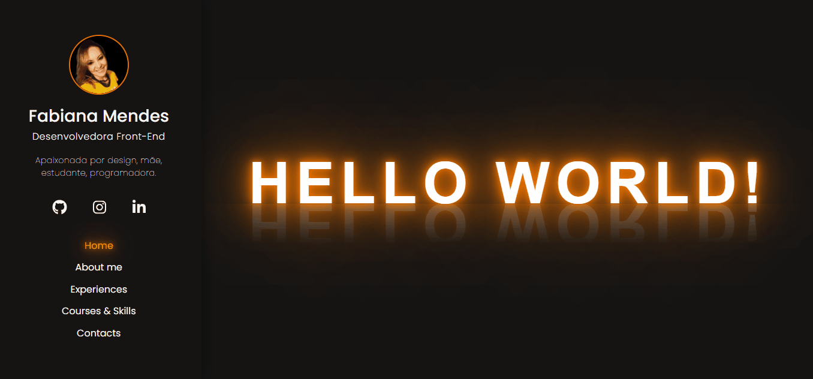

<h1 align="center">CV-Web - Fabiana M. Mendes</h1>

<p align="center" >  
    <a href="#description">Description</a> • 
    <a href="#status">Status</a> • 
    <a href="#requirements">Requirements</a> • 
    <a href="#how to run the app">How to run the App</a> • 
    <a href="#technologies">Technologies</a> • 
    <a href="#version">Version</a> • 
</p>


## Description
A simple React-app with my profissional information.


## Status
 🚧  Under construction  🚧 


## Requirements
Before you begin, you will need to have installed on your machine:
- Browser [Google Chrome](https://www.google.com/intl/pt-BR/chrome/), [Mozzila Firefox](https://www.mozilla.org/pt-BR/firefox/new/) or [Opera](https://www.opera.com/pt-br/download)
- Code editor [Visual Studio Code](https://code.visualstudio.com/)
- [Node v14.15.4](https://nodejs.org/en/) or superior LTS version (includes npm)
- [Git](https://git-scm.com/book/en/v2/Getting-Started-Installing-Git) 


## How to run the app
- Open cmd and clone the repository:
``` $ git clone https://github.com/FabianaMendes/react-portfolio.git ``` 
- Access project folder in terminal/cmd: 
``` $ cd front-web ```
- Install the dependencies:
``` $ npm install ```
- To open the project in the code editor: 
``` $ code . ``` 
- To run the application locally in your browser:
``` $ npm start ```
_The server will automatically start at port:3006 - access [http://localhost:3006](http://localhost:3006)
To stop the application press Ctrl + c_


## Technologies
The following tools were used in the construction of this project:

**Website ([React](https://pt-br.reactjs.org/))**
- [React Router](https://reactrouter.com/web/guides/quick-start)
- [React Hooks](https://pt-br.reactjs.org/docs/hooks-intro.html)
- [React Context.Provider](https://pt-br.reactjs.org/docs/context.html)
- [FontAwesome Library](https://fontawesome.com/how-to-use/on-the-web/using-with/react)
- [Remask](https://github.com/brunobertolini/remask)
- [React Recaptcha](https://www.npmjs.com/package/react-recaptcha)
- [Axios](https://www.npmjs.com/package/axios)

**Utilities**
- Prototype: [Figma](https://www.figma.com)
- Editor: [Visual Studio Code](https://code.visualstudio.com/)
- Icons: [Font Awesome](https://fontawesome.com)
- Google Fonts: [Poppins](https://fonts.google.com/specimen/Poppins?query=popp)


## Version
<p>Version 1.0</p> 